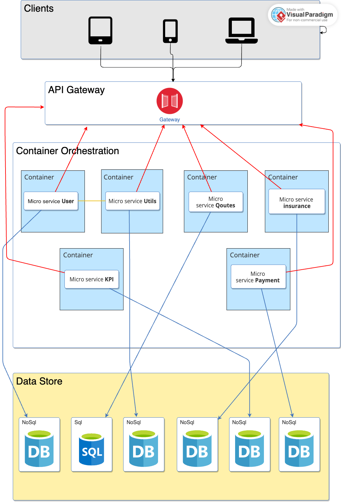
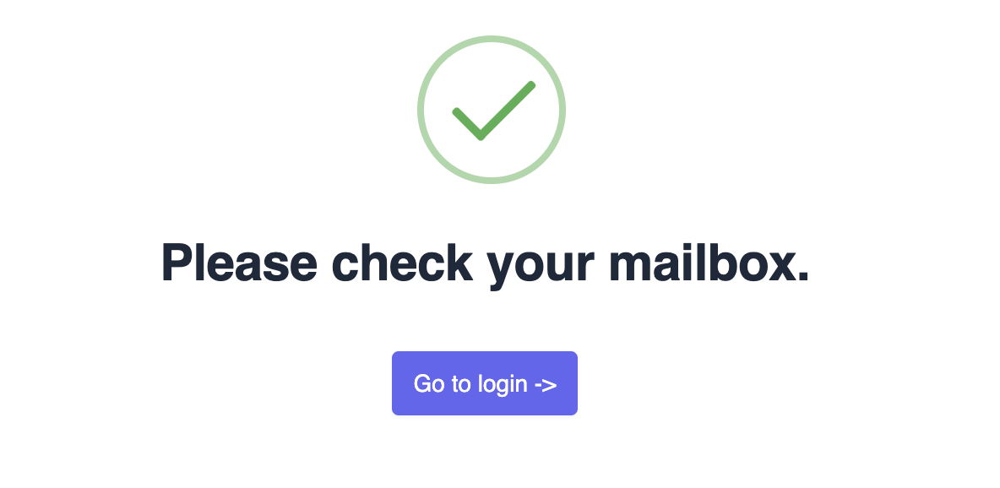
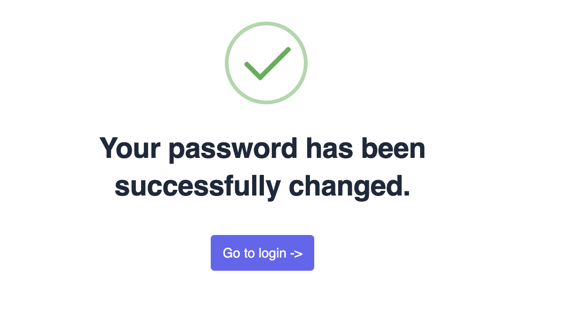
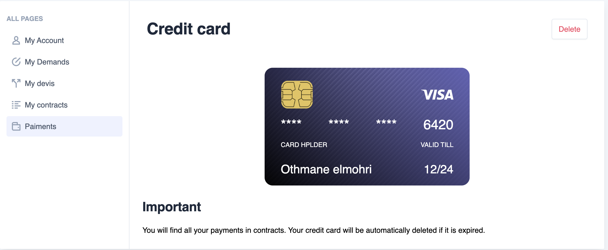

Challenge-app-esgi-assurance <!-- omit in toc -->
===


[Azulance](https://github.com/elmohriothmane/Challenge-app-esgi-assurance) is based on the [Nest](https://github.com/nestjs/nest) and [VueJs](https://vuejs.org/) framework.

---


# Table of Contents <!-- omit in toc -->

- [1. Getting Started](#1-getting-started)
  - [1.1. Azulance Architecture](#11-azulance-architecture)
  - [1.2. Installing](#12-installing)
  - [1.3. Running](#13-running)
  - [1.4. Testing](#14-testing)
  - [1.5. Swagger documentation](#15-swagger-documentation)
- [2. Recommended VS Code extensions](#2-recommended-vs-code-extensions)
  - [2.1. Markdown All in One](#21-markdown-all-in-one)
  - [2.2. ESLint](#22-eslint)
- [3. Project description](#3-project-description)
  - [3.1. Project initialization](#31-project-initialization)
  - [3.2. Installed packages](#32-installed-packages)
  - [3.3. Workflows](#33-workflows)
     - [3.3.1. Registration](#331-registration)
     - [3.3.2. Login](#332-login)
     - [3.3.3. Credit card](#333-credit-card)

---

# 1. Getting Started

## 1.1. Azulance Architecture
Azulance follows a microservices architecture, which is a decentralized architectural style that allows for the development of loosely coupled and independently deployable services. This architecture promotes scalability, flexibility, and resilience. Here is an overview of the Azulance microservices architecture:



## 1.2. Installing

```bash
docker-compose --build
```

## 1.3. Running

```bash
docker-compose up -d
```
## 1.4. Testing

```bash
# unit tests
$ npm run test

# e2e tests
$ npm run test:e2e

# test coverage
$ npm run test:cov
```

## 1.5. Swagger documentation

The Swagger documentation url is `https?://{host_name(:port)?}/api/vX/`.

---

# 2. Recommended VS Code extensions

Here, there is a summary of some recommended `VS Code` extensions.

## 2.1. Markdown All in One

It has some useful functionalities for editing Markdown files like keyboard shortcuts, table of contents, section numbering...

To install the `Markdown All in One` extension to `VS Code`, see [yzhang.markdown-all-in-one](https://marketplace.visualstudio.com/items?itemName=yzhang.markdown-all-in-one).
```sh
code --install-extension yzhang.markdown-all-in-one
```

## 2.2. ESLint

It used to find and fix problems with an integration to the `VS Code` editor, see [eslint.org](https://eslint.org/).

To install the `ESLint` extension to `VS Code`, see [dbaeumer.vscode-eslint](https://marketplace.visualstudio.com/items?itemName=dbaeumer.vscode-eslint).
```sh
code --install-extension dbaeumer.vscode-eslint
```
To show and fix issues, see doc of [dbaeumer.vscode-eslint](https://marketplace.visualstudio.com/items?itemName=dbaeumer.vscode-eslint). For example,
```sh
npm install -g eslint
eslint --init
```

To install additional plugins into a project like
- [`eslint-plugin-import`](https://github.com/benmosher/eslint-plugin-import#readme) with [`eslint-import-resolver-typescript`](https://github.com/alexgorbatchev/eslint-import-resolver-typescript#readme) (?), see also an issue with configs: 
  - [Stack Overflow: Unable to resolve path to module](https://stackoverflow.com/questions/55198502/using-eslint-with-typescript-unable-to-resolve-path-to-module)
  - [Stack Overflow: Module has no exported member](https://stackoverflow.com/questions/65187695/which-rule-to-enable-to-throw-module-has-no-exported-member-in-eslint-cli-outp)
```sh
npm i -D eslint-plugin-import @typescript-eslint/parser eslint-import-resolver-typescript eslint-plugin-simple-import-sort 
```

---

# 3. Project description

## 3.1. Project initialization

This project is created with `NestJS Framework`, see its [documentation](https://docs.nestjs.com/).

- To install `Nest CLI`
```sh
npm i -g @nestjs/cli
```

- To generate this project
```sh
nest new midgard-telemetry
```

## 3.2. Installed packages

- Configuration variables environment `.env`
- To define your environment variables, you need to create a .env file. You can find an example file named `.env.example` to assist you. Follow the steps below to set up your environment variables:

    - Copy the `.env.example` file and create a new file called `.env`.

    - Open the `.env` file in a text editor of your choice.

    - Replace the placeholder values in the `.env` file with your specific configuration. Ensure each environment variable is defined correctly for your project.

    - Save the `.env` file.
    
```sh
npm install --save @nestjs/config
```

- `MongoDB` database
```sh
npm install --save @nestjs/mongoose mongoose 
```

- `Swagger` for RESTful APIs descriptions
```sh
npm install --save @nestjs/swagger swagger-ui-express
```

- Data validators
```sh
npm install --save class-validator class-transformer validator
```

- `JWT` authentication with `Passport` (see [JWT Auth with Mongoose](https://github.com/pejmanhadavi/real-world-example-nestjs-mongoose-jwt-auth))
```sh
npm install --save @nestjs/jwt @nestjs/passport passport passport-local passport-jwt bcrypt
npm install --save-dev @types/passport-local @types/passport-jwt
npm install --save generate-password
```


## 3.3. Workflows
## 3.3.1. Registration
Follow these steps to create a profile in Azulance:

- Fill out all the required fields in the registration form. Make sure to provide accurate information.


- Once you have completed the form, click the "Submit" button to proceed with the registration.


- Check your email inbox for a confirmation message from Azulance. It may take a few minutes for the email to arrive.
- Open the email and locate the confirmation link provided. Click on the link to verify your email address and activate your account.
- After clicking the confirmation link, you will be redirected to the Azulance website.


Congratulations! You now have a profile in Azulance. You can log in using your registered email address and the password you provided during the registration process.

Please note that if you do not receive the confirmation email, make sure to check your spam. If you still encounter any issues, you can contact our support team for further assistance.


## 3.3.2. Login
Follow these steps to log in to your Azulance account:

- On the Azulance website, click on the "Login" button to access the login page.

- Enter your registered email address and password in the provided fields. Make sure to input the correct credentials associated with your account.
- After filling in your email and password, click on the "Login" or "Sign In" button to proceed.


- If the email and password combination is correct, you will be redirected to the homepage/dashboard of your Azulance account.


Congratulations! You have successfully logged in to your Azulance account and can now access all the features and functionalities available.

If you forget your password, follow these steps to reset it:

- On the login page, click on the "Forgot Password" or "Reset Password" link/button.

- You will be redirected to the password reset page. Enter the email address associated with your account.


- Click on the "Submit" or "Reset Password" button.



- Check your email inbox for a password reset link from Azulance. Be sure to also check your spam or junk folder if you don't see the email in your primary inbox.

- Open the email and click on the password reset link provided. This will take you to a page where you can create a new password.


- Choose a strong, unique password and enter it in the provided fields. Follow any specified password requirements (e.g., minimum character length, including special characters).


- Once you have entered your new password, click on the "Save" or "Reset Password" button.



- Your password has been successfully reset. You can now log in to your Azulance account using your updated password.

Remember to keep your login credentials secure and avoid sharing them with anyone. If you encounter any issues during the login or password reset process, please contact our support team for assistance.

## 3.3.3. Credit Card
Follow these steps to manage your credit card information in your Azulance profile:

- In your profile settings or account dashboard, locate the "Payment" or "Billing" section.

- Click on "Add Credit Card" option to add your credit card information for future payments.


- Fill in the required fields with your credit card details, including the card number, expiration date, CVV, and billing address. Ensure that you provide accurate and up-to-date information.


- Once you have entered the necessary details, click on the "Save" or "Add Card" button to securely store your credit card information.



Congratulations! Your credit card has been successfully added to your Azulance account, and you can now use it for future payments.

To delete a credit card from your account, follow these steps:

- Go to the "Payment" section in your profile settings or account dashboard.

- Click on the "Delete" or "Remove" option next to the respective credit card.


- The credit card will be permanently deleted from your Azulance profile.

Please note that it is important to handle your credit card information with care and only store it in trusted and secure platforms. If you encounter any issues or have concerns about the security of your credit card information, please reach out to our support team for assistance.


---
## Development team
 

- Developer - [Zaid ALAA HAZIM](https://www.linkedin.com/in/zaid-alaa-hazim/)
- Developer - [Othmanei ELMOHRI](https://www.linkedin.com/in/othmane-elmohri/)
- Developer - [Slimane ACHBOUQ](https://www.linkedin.com/in/slimane-achbouq/)
- Developer - [Zakaria Attaoui](https://www.linkedin.com/in/zakaria-attaoui-29b24b1b2/)
---
<p align="center">
  <a href="https://www.esgi.fr/" target="blank"></a>
</p>

---